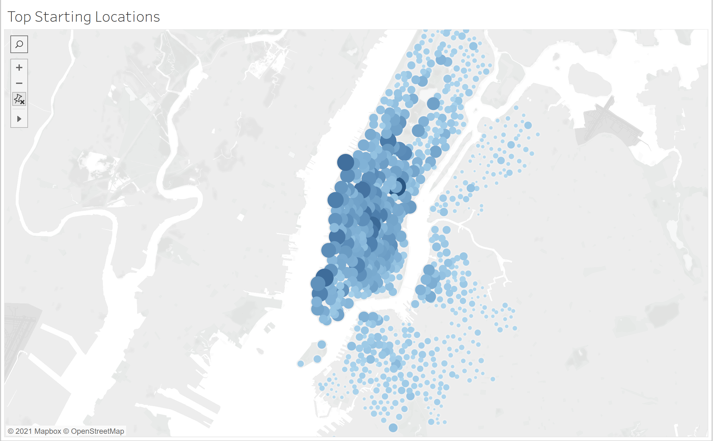
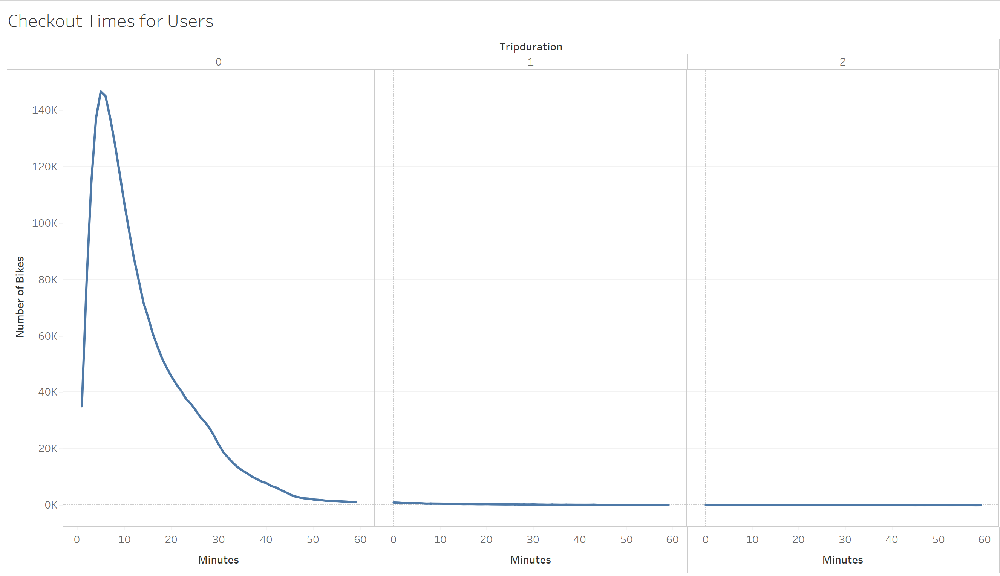
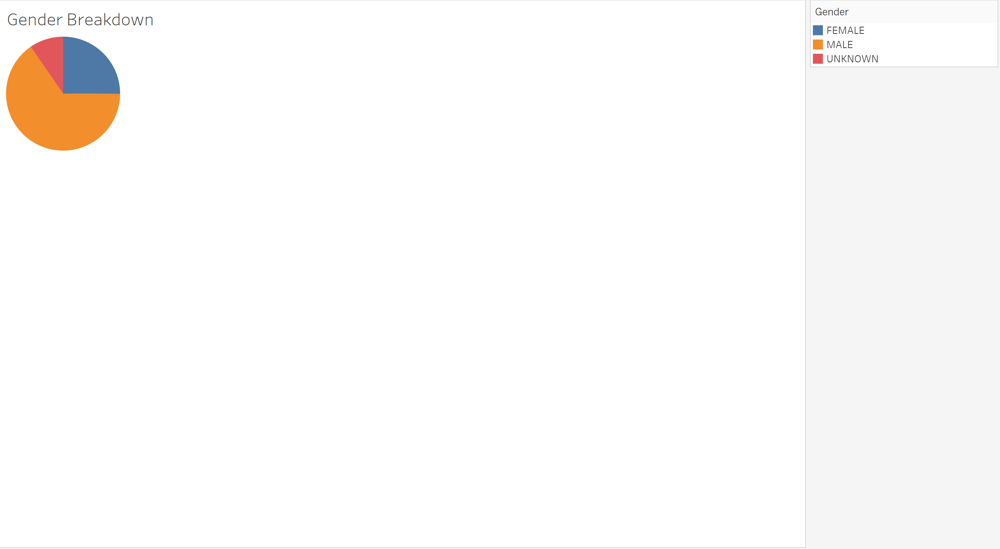
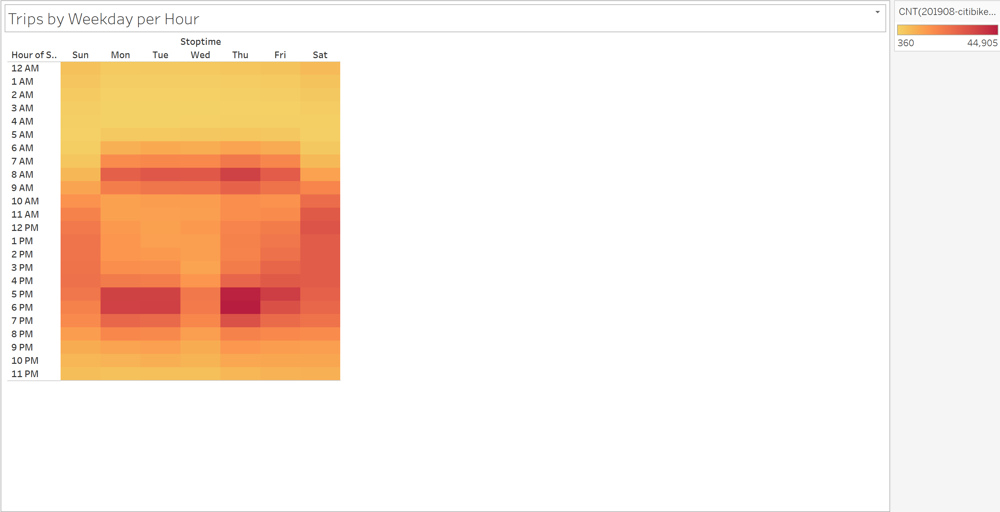
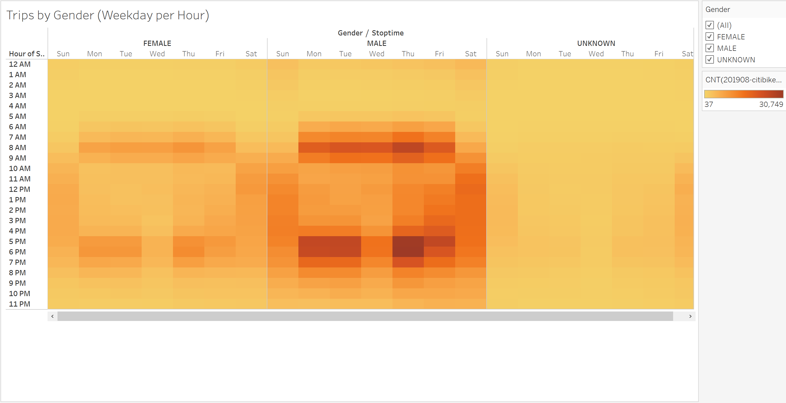
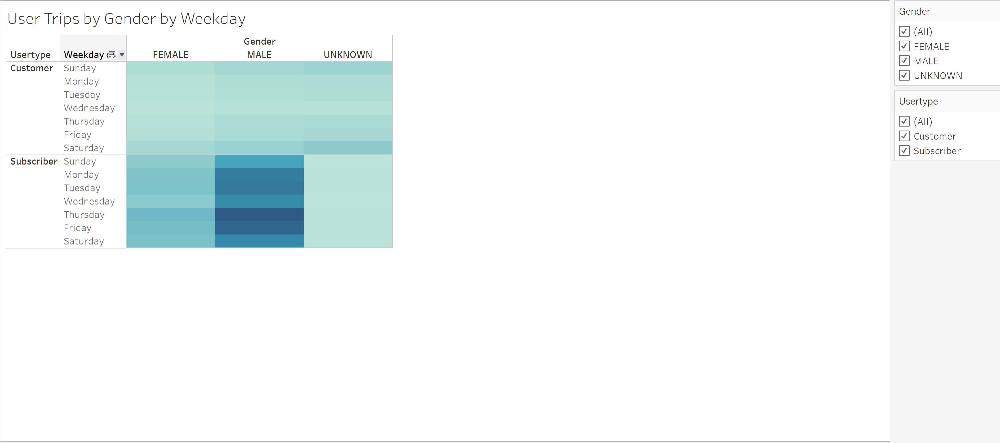

# Module 14 Challenge - NYC Citibike Analysis

## Overview
The purpose of this exercise is to convince business investors that a bike-sharing program in Des Moines is a solid business proposal.

## Results

The following sections describe the visualizations that were created for the story. The link to the Tableau dashboard is provided below:

[Link to Dashboard](https://public.tableau.com/views/BikeSharingTripDataChallenge/CheckoutTimesforUsers?:language=en-US&publish=yes&:display_count=n&:origin=viz_share_link)

### Top Starting Locations

The visualization above shows the top starting locations in NY City for starting a bike journey. The size of the circles and the intensity of the color shows the relative popularity of the starting location. 

### Checkout Times for Users

The figure above shows the length of time bikes are checked out for all genders and users. From this visualization we can see that shorter durations tended to be more popular. The highest number of bikes checked out were for the 5 minute duration (~146K). At the same time more than 100K bikes were rented out for durations between 3 to 10 minutes.

### Gender Breakdown

The visualization above shows the gender breakdown. It shows that Male bikers were the majority with ~1.53 Million, whereas females were ~588K. The remainder was unknown at ~225K.

### Checkout Times by Gender

The figure above shows the checkout times by gender. The shorter durations of checkout were popular for both male and female users. The most popular time for males was 5 minures (~108K bikes checked out), whereas for females the most popular time was 6 minutes ( ~34,151 checkouts).

### Trips By Weekday Per Hour

The figure above shows the heatmap for the trips by weekday per hour. We can see that the times between 5:00-7:00 PM tended to be the most popular on Mondays, Tuesdays and Thursdays. Also 8-9 AM was a popular time on Mondays through Fridays. 

### Trips By Gender (Weekday per Hour)

The figure above shows the Trips by Gender (weekdays per hour). This reflects a similar pattern as the previous section. In addition it reflects that Male users tended to be the majority of the users. The pattern of usage seems quite similar between Male and Female users, in terms of the times of the day, as described in the previous section.

### User Trips by Gender by Weekday

From the above figure we can see that Male Subscribers were the majority of the users, with the heaviest usage coming on Thursdays and Fridays.

## Summary

The results show that bike usage is dominated by Male riders, and specifically by Male Subscribers. Monday, Tuesday and Thursday evenings between 5-7 PM were the busiest times, and also 8-9 AM in the mornings on Mondays through Fridays. For the weekends, Saturday usage was higher compared to Sunday. 

Two additional visualizations that could be performed with this dataset could be the Top ending locations and average trip duration by age.

